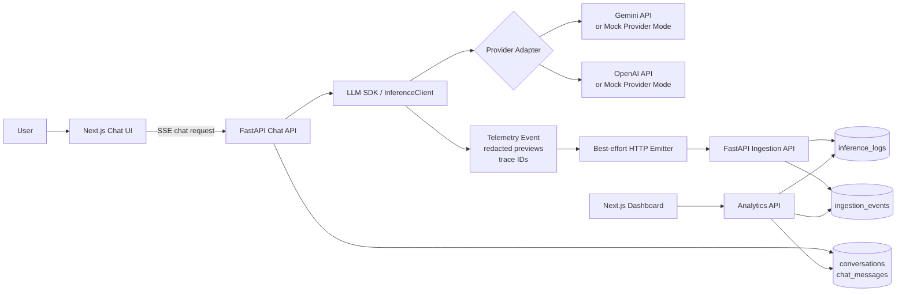
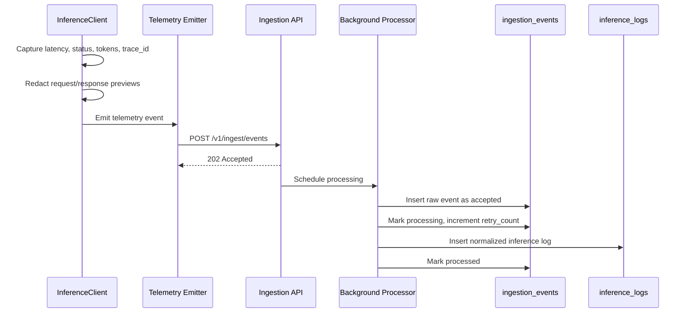
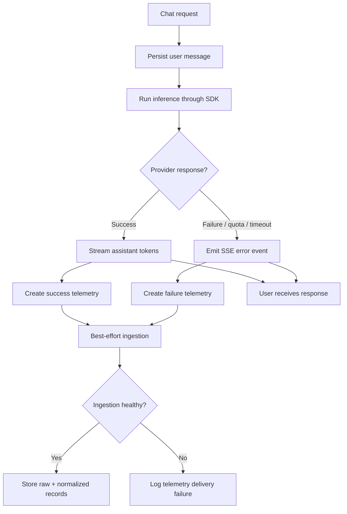

# Architecture Diagrams

## System Architecture

```mermaid
flowchart LR
    user[User] --> frontend[Next.js Chat UI]
    frontend -->|SSE chat request| api[FastAPI Chat API]
    api --> chat[(conversations<br/>chat_messages)]
    api --> sdk[LLM SDK / InferenceClient]
    sdk --> provider{Provider Adapter}
    provider --> gemini[Gemini API<br/>or Mock Provider Mode]
    provider --> openai[OpenAI API<br/>or Mock Provider Mode]
    sdk --> telemetry[Telemetry Event<br/>redacted previews<br/>trace IDs]
    telemetry --> emitter[Best-effort HTTP Emitter]
    emitter --> ingest[FastAPI Ingestion API]
    ingest --> raw[(ingestion_events)]
    ingest --> logs[(inference_logs)]
    dashboard[Next.js Dashboard] --> analytics[Analytics API]
    analytics --> logs
    analytics --> raw
    analytics --> chat
```

## Ingestion Lifecycle

```mermaid
sequenceDiagram
    participant SDK as InferenceClient
    participant Emitter as Telemetry Emitter
    participant API as Ingestion API
    participant Worker as Background Processor
    participant Raw as ingestion_events
    participant Logs as inference_logs

    SDK->>SDK: Capture latency, status, tokens, trace_id
    SDK->>SDK: Redact request/response previews
    SDK->>Emitter: Emit telemetry event
    Emitter->>API: POST /v1/ingest/events
    API-->>Emitter: 202 Accepted
    API->>Worker: Schedule processing
    Worker->>Raw: Insert raw event as accepted
    Worker->>Raw: Mark processing, increment retry_count
    Worker->>Logs: Insert normalized inference log
    Worker->>Raw: Mark processed
```

## Failure Isolation Flow

```mermaid
flowchart TD
    request[Chat request] --> persistUser[Persist user message]
    persistUser --> infer[Run inference through SDK]
    infer --> providerOk{Provider response?}
    providerOk -->|Success| stream[Stream assistant tokens]
    providerOk -->|Failure / quota / timeout| streamError[Emit SSE error event]
    stream --> telemetrySuccess[Create success telemetry]
    streamError --> telemetryFailure[Create failure telemetry]
    telemetrySuccess --> ingestion[Best-effort ingestion]
    telemetryFailure --> ingestion
    ingestion --> ingestionOk{Ingestion healthy?}
    ingestionOk -->|Yes| store[Store raw + normalized records]
    ingestionOk -->|No| logOnly[Log telemetry delivery failure]
    stream --> user[User receives response]
    streamError --> user
```
